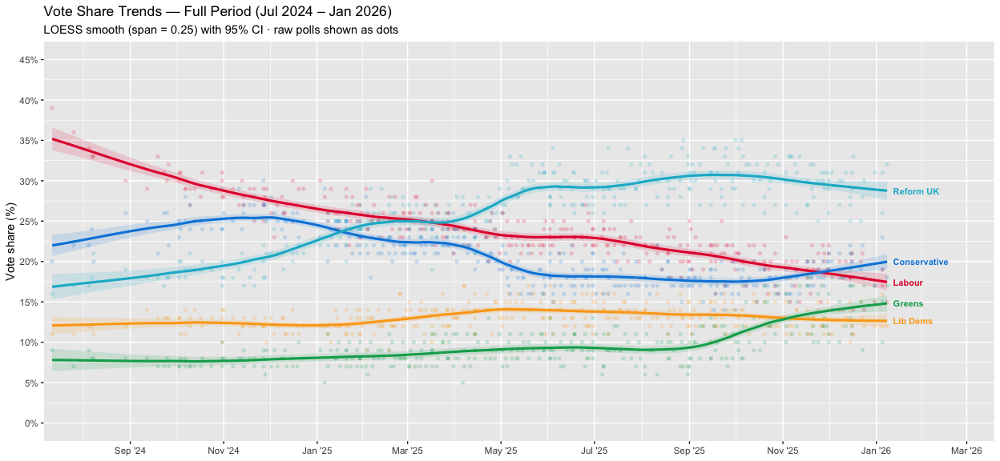
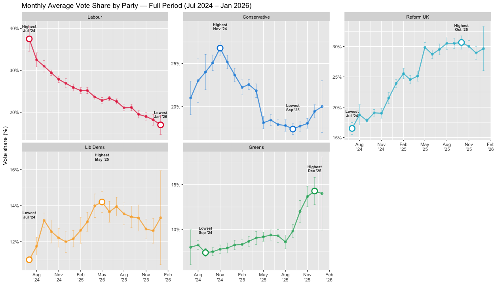
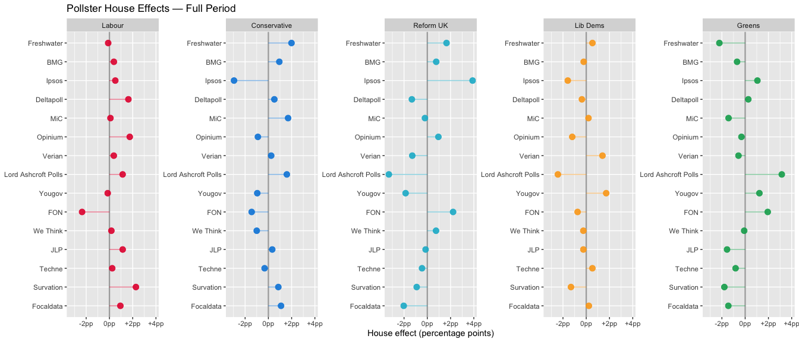
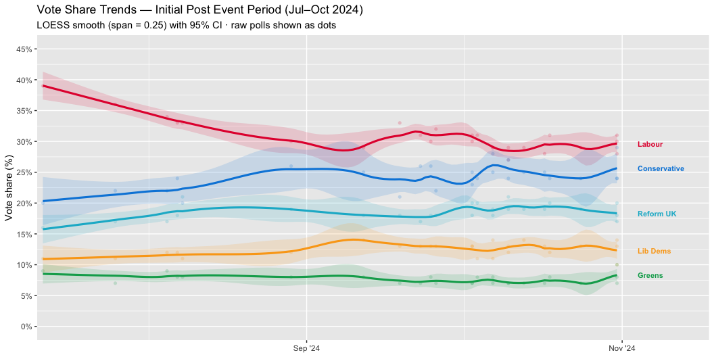
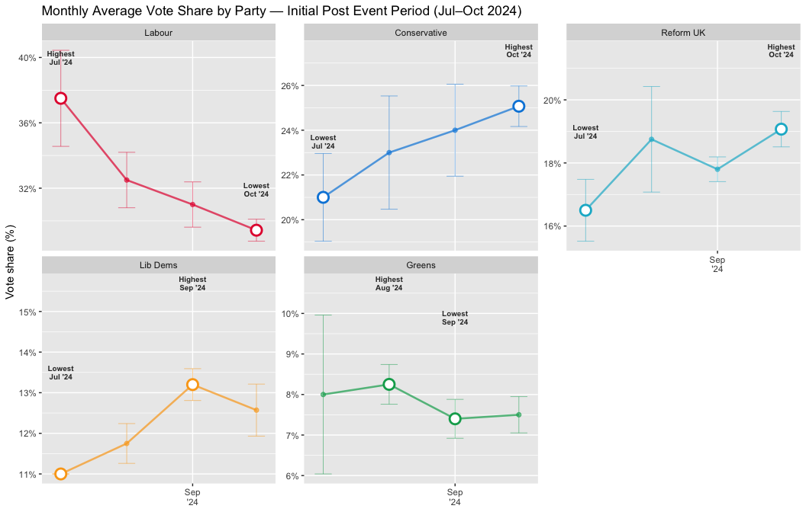
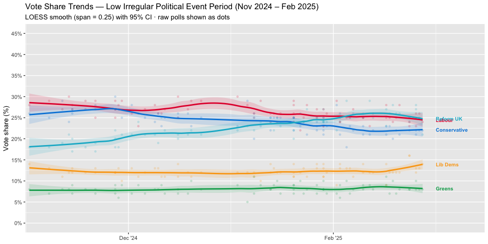
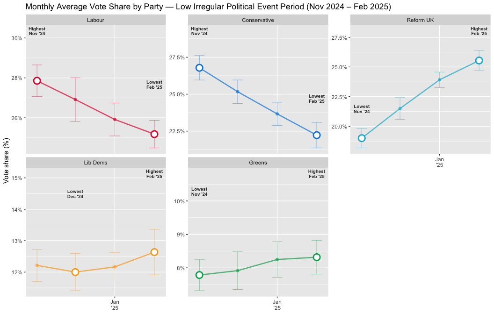
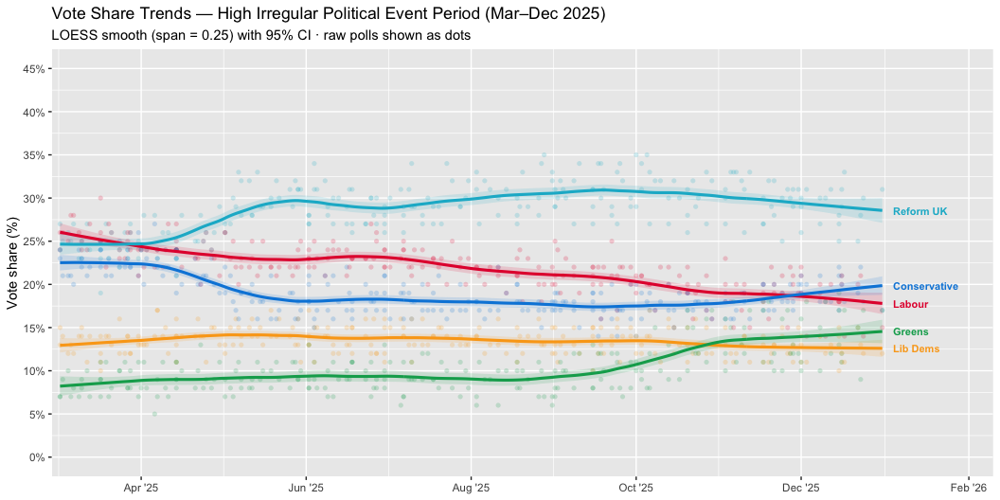
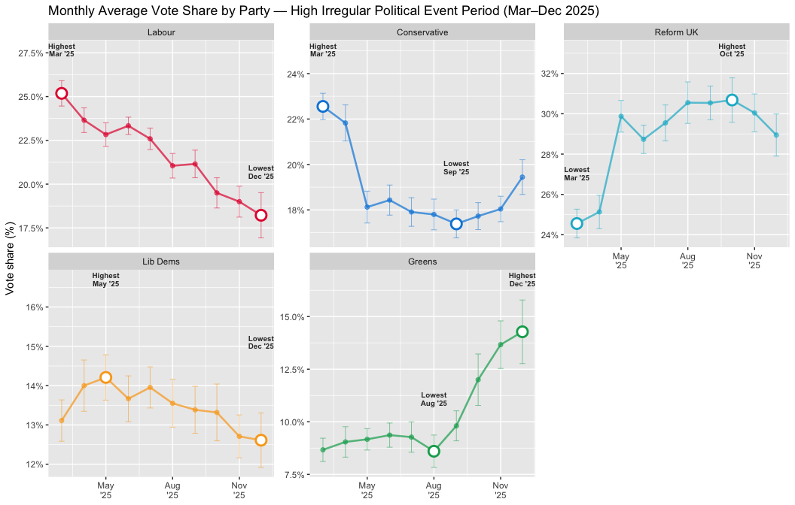

Voting Trends
================

``` r
# load the packages
packages <- c("tidyverse", "lubridate", "scales", "patchwork", "glue", "knitr")
invisible(lapply(packages, library, character.only = TRUE))
```

    ## ── Attaching core tidyverse packages ──────────────────────── tidyverse 2.0.0 ──
    ## ✔ dplyr     1.2.1     ✔ readr     2.2.0
    ## ✔ forcats   1.0.1     ✔ stringr   1.6.0
    ## ✔ ggplot2   4.0.2     ✔ tibble    3.3.1
    ## ✔ lubridate 1.9.5     ✔ tidyr     1.3.2
    ## ✔ purrr     1.2.1     
    ## ── Conflicts ────────────────────────────────────────── tidyverse_conflicts() ──
    ## ✖ dplyr::filter() masks stats::filter()
    ## ✖ dplyr::lag()    masks stats::lag()
    ## ℹ Use the conflicted package (<http://conflicted.r-lib.org/>) to force all conflicts to become errors
    ## 
    ## Attaching package: 'scales'
    ## 
    ## 
    ## The following object is masked from 'package:purrr':
    ## 
    ##     discard
    ## 
    ## 
    ## The following object is masked from 'package:readr':
    ## 
    ##     col_factor

``` r
# set colors and labels for the parties
main_parties <- c("Lab", "Con", "Ref", "LD", "Grn")

party_colours <- c(
  Lab = "#E4003B",
  Con = "#0087DC",
  Ref = "#12B6CF",
  LD  = "#FAA61A",
  Grn = "#02A95B"
)

party_names <- c(
  Lab = "Labour",
  Con = "Conservative",
  Ref = "Reform UK",
  LD  = "Lib Dems",
  Grn = "Greens"
)

LOESS_SPAN <- 0.25 # smoothing parameter for LOESS based on Jackman (2005)
```

``` r
# data cleaning

clean_polls <- function(filepath) {

  raw <- read_csv(filepath, show_col_types = FALSE, name_repair = "minimal") %>%
    rename_with(~ str_remove(.x, "\ufeff")) %>%   # strip BOM
    rename_with(tolower)

  cleaned <- raw %>%
    mutate(
      # format dates
      date = suppressWarnings(case_when(
        !is.na(dmy(date)) ~ dmy(date),
        !is.na(mdy(date)) ~ mdy(date),
        TRUE ~ NA_Date_
      )),
      n = as.numeric(str_remove_all(as.character(n), ","))
    ) %>%
    filter(!is.na(date)) %>%
    arrange(date)

  # select and keep the five main paries - Labour, Conservatives, Reform UK, Lib Dems, Greens
  long <- cleaned %>%
    select(date, pollster, n, lab, con, ref, ld, grn) %>%
    rename(Lab = lab, Con = con, Ref = ref, LD = ld, Grn = grn) %>%
    pivot_longer(
      cols      = all_of(main_parties),
      names_to  = "party",
      values_to = "vote_share"
    ) %>%
    filter(!is.na(vote_share))

   message("Loaded ", n_distinct(paste(long$date, long$pollster)) / length(main_parties), " polls")
  
  return(long)
}
```

``` r
# subset for repeatability and draw monthly averages

subset_period <- function(df, start, end) {
  df %>% filter(date >= ymd(start), date <= ymd(end))
}

monthly_summary <- function(df) {

  df %>%
    mutate(month = floor_date(date, "month")) %>%
    group_by(month, party) %>%
    summarise(
      mean_share = mean(vote_share, na.rm = TRUE),
      se         = sd(vote_share, na.rm = TRUE) / sqrt(n()),
      n_polls    = n(),
      .groups    = "drop"
    ) %>%
    group_by(party) %>%
    mutate(
      rank_label = case_when(
        mean_share == max(mean_share) ~ "Highest",
        mean_share == min(mean_share) ~ "Lowest",
        TRUE                          ~ NA_character_
      )
    ) %>%
    ungroup() %>%
    mutate(party = factor(party, levels = main_parties))
}
```

``` r
# fit LOESS smoother to polls data

smooth_polls <- function(df, span = LOESS_SPAN) {

  date_seq <- seq(min(df$date), max(df$date), by = "day")

  map_dfr(main_parties, function(p) {

    sub <- df %>% filter(party == p) %>% mutate(t = as.numeric(date))

    if (nrow(sub) < 5) {
      warning(glue("omit '{p}': fewer than 5 observations."))
      return(NULL)
    }

    fit  <- suppressWarnings(
      loess(vote_share ~ t, data = sub, span = span, degree = 1,
            na.action = na.exclude)
    )
    pred <- suppressWarnings(
      predict(fit, newdata = data.frame(t = as.numeric(date_seq)), se = TRUE)
    )

    tibble(
      date     = date_seq,
      party    = p,
      estimate = pred$fit,
      ci_lo    = pred$fit - 1.96 * pred$se.fit,
      ci_hi    = pred$fit + 1.96 * pred$se.fit
    )
  }) %>%
    filter(!is.na(estimate)) %>%
    mutate(party = factor(party, levels = main_parties))
}
```

``` r
# estimate house effects for pollsters 

house_effects <- function(df) {
  grand_means <- df %>%
    mutate(month = floor_date(date, "month")) %>%
    group_by(month, party) %>%
    summarise(grand_mean = mean(vote_share, na.rm = TRUE), .groups = "drop")

  df %>%
    mutate(month = floor_date(date, "month")) %>%
    left_join(grand_means, by = c("month", "party")) %>%
    mutate(deviation = vote_share - grand_mean) %>%
    group_by(pollster, party) %>%
    summarise(
      house_effect = mean(deviation, na.rm = TRUE),
      n_polls      = n_distinct(date),
      .groups      = "drop"
    ) %>%
    filter(n_polls >= 3) %>%
    arrange(party, desc(abs(house_effect)))
}
```

``` r
# loess plot

plot_trends <- function(raw, smoothed, period_label) {

  latest <- smoothed %>%
    group_by(party) %>%
    filter(date == max(date)) %>%
    ungroup()

  ggplot() +
    geom_point(
      data  = raw,
      aes(x = date, y = vote_share, colour = party),
      alpha = 0.2, size = 1.5, shape = 16
    ) +
    geom_ribbon(
      data  = smoothed,
      aes(x = date, ymin = ci_lo, ymax = ci_hi, fill = party),
      alpha = 0.15
    ) +
    geom_line(
      data      = smoothed,
      aes(x = date, y = estimate, colour = party),
      linewidth = 1.1
    ) +
    geom_text(
      data  = latest,
      aes(x = date + days(4), y = estimate,
          label = party_names[as.character(party)], colour = party),
      hjust = 0, size = 2.9, fontface = "bold"
    ) +
    scale_colour_manual(values = party_colours, guide = "none") +
    scale_fill_manual(values   = party_colours, guide = "none") +
    scale_y_continuous(labels  = label_number(suffix = "%"),
                       limits  = c(0, 45), breaks = seq(0, 45, 5)) +
    scale_x_date(
      date_breaks = "2 months", date_labels = "%b '%y",
      expand = expansion(mult = c(0.01, 0.12))
    ) +
    labs(
      title    = glue("Vote Share Trends — {period_label}"),
      subtitle = glue("LOESS smooth (span = {LOESS_SPAN}) with 95% CI · raw polls shown as dots"),
      x = NULL, y = "Vote share (%)"
    ) 
}
```

``` r
# Monthly averages plot

plot_monthly_faceted <- function(monthly, period_label) {

  high_low <- monthly %>% filter(!is.na(rank_label))

  high_low <- high_low %>%
    mutate(month_label = format(month, "%b '%y"))

  ggplot(monthly, aes(x = month, y = mean_share, colour = party)) +
    geom_line(linewidth = 0.9, alpha = 0.7) +
    geom_point(size = 1.8, alpha = 0.6) +
    geom_errorbar(
      aes(ymin = mean_share - 1.96 * se, ymax = mean_share + 1.96 * se),
      width = 8, linewidth = 0.35, alpha = 0.5
    ) +
    geom_point(
      data  = high_low,
      aes(x = month, y = mean_share, colour = party),
      size = 4, shape = 21, fill = "white", stroke = 1.5
    ) +
    geom_text(
      data  = high_low,
      aes(x = month, y = mean_share + 2.5, label = glue("{rank_label}\n{month_label}")),
      size = 2.6, fontface = "bold", colour = "#333333", lineheight = 0.9
    ) +
    facet_wrap(~ party, nrow = 2, scales = "free_y",
               labeller = as_labeller(party_names)) +
    scale_colour_manual(values = party_colours, guide = "none") +
    scale_x_date(date_breaks = "3 months", date_labels = "%b\n'%y") +
    scale_y_continuous(labels = label_number(suffix = "%")) +
    labs(
      title    = glue("Monthly Average Vote Share by Party — {period_label}"),
      x = NULL, y = "Vote share (%)"
    )
}
```

``` r
# House Effects Plot

plot_house_effects <- function(he, period_label) {

  he_plot <- he %>%
    mutate(
      party    = factor(party, levels = main_parties),
      pollster = fct_reorder(pollster, house_effect, .fun = mean)
    )

  ggplot(he_plot, aes(x = house_effect, y = pollster, colour = party)) +
    geom_vline(xintercept = 0, colour = "#aaa", linewidth = 0.8) +
    geom_segment(
      aes(x = 0, xend = house_effect, yend = pollster),
      linewidth = 0.55, alpha = 0.5
    ) +
    geom_point(size = 3.2, alpha = 0.9) +
    facet_wrap(~ party, nrow = 1, scales = "free_y",
               labeller = as_labeller(party_names)) +
    scale_colour_manual(values = party_colours, guide = "none") +
    scale_x_continuous(
      labels = label_number(suffix = "pp", style_positive = "plus")
    ) +
    labs(
      title    = glue("Pollster House Effects — {period_label}"),
      x = "House effect (percentage points)", y = NULL
    )
}
```

``` r
# repeatability analysis 

run_wave <- function(df, start_date, end_date, label) {

  cat("\n", strrep("═", 58), "\n")
  cat(glue("  WAVE: {label}\n"))
  cat(strrep("═", 58), "\n")

  sub     <- subset_period(df, start_date, end_date)
  n_polls <- n_distinct(paste(sub$date, sub$pollster)) / length(main_parties)
  cat(glue("  Polls in window: {round(n_polls)}\n",
           "  Date range:      {min(sub$date)} — {max(sub$date)}\n\n"))

  smoothed <- smooth_polls(sub)
  monthly  <- monthly_summary(sub)
  he       <- house_effects(sub)

  # Print summary table
  monthly %>%
    filter(!is.na(rank_label)) %>%
    mutate(
      Party  = party_names[as.character(party)],
      Month  = format(month, "%B %Y"),
      `Mean %` = round(mean_share, 1)
    ) %>%
    select(Party, Type = rank_label, Month, `Mean %`) %>%
    arrange(Party, desc(`Mean %`)) %>%
    knitr::kable(format = "simple") %>%
    print()

  list(
    sub        = sub,
    smoothed   = smoothed,
    monthly    = monthly,
    he         = he,
    trend_p    = plot_trends(sub, smoothed, label),
    monthly_p  = plot_monthly_faceted(monthly, label),
    house_p    = plot_house_effects(he, label)
  )
}
```

``` r
# Execute the code
polls <- clean_polls("all_polls_2025.csv")
```

    ## Loaded 66 polls

``` r
he_full    <- house_effects(polls)
p_he_full  <- plot_house_effects(he_full, "Full Period")

# wave 1
w1 <- run_wave(polls,
               start_date = "2024-07-01",
               end_date   = "2024-10-31",
               label      = "Initial Post Event Period (Jul–Oct 2024)")
```

    ## 
    ##  ══════════════════════════════════════════════════════════ 
    ## WAVE: Initial Post Event Period (Jul–Oct 2024)══════════════════════════════════════════════════════════ 
    ## Polls in window: 5
    ## Date range:      2024-07-12 — 2024-10-31
    ## 
    ## 
    ## Party          Type      Month             Mean %
    ## -------------  --------  ---------------  -------
    ## Conservative   Highest   October 2024        25.1
    ## Conservative   Lowest    July 2024           21.0
    ## Greens         Highest   August 2024          8.2
    ## Greens         Lowest    September 2024       7.4
    ## Labour         Highest   July 2024           37.5
    ## Labour         Lowest    October 2024        29.4
    ## Lib Dems       Highest   September 2024      13.2
    ## Lib Dems       Lowest    July 2024           11.0
    ## Reform UK      Highest   October 2024        19.1
    ## Reform UK      Lowest    July 2024           16.5

``` r
# wave 2
w2 <- run_wave(polls,
               start_date = "2024-11-01",
               end_date   = "2025-02-28",
               label      = "Low Irregular Political Event Period (Nov 2024 – Feb 2025)")
```

    ## 
    ##  ══════════════════════════════════════════════════════════ 
    ## WAVE: Low Irregular Political Event Period (Nov 2024 – Feb 2025)══════════════════════════════════════════════════════════ 
    ## Polls in window: 14
    ## Date range:      2024-11-01 — 2025-02-28
    ## 
    ## 
    ## Party          Type      Month            Mean %
    ## -------------  --------  --------------  -------
    ## Conservative   Highest   November 2024      26.8
    ## Conservative   Lowest    February 2025      22.2
    ## Greens         Highest   February 2025       8.3
    ## Greens         Lowest    November 2024       7.8
    ## Labour         Highest   November 2024      27.9
    ## Labour         Lowest    February 2025      25.2
    ## Lib Dems       Highest   February 2025      12.6
    ## Lib Dems       Lowest    December 2024      12.0
    ## Reform UK      Highest   February 2025      25.5
    ## Reform UK      Lowest    November 2024      19.0

``` r
# wave 3
w3 <- run_wave(polls,
               start_date = "2025-03-01",
               end_date   = "2025-12-31",
               label      = "High Irregular Political Event Period (Mar–Dec 2025)")
```

    ## 
    ##  ══════════════════════════════════════════════════════════ 
    ## WAVE: High Irregular Political Event Period (Mar–Dec 2025)══════════════════════════════════════════════════════════ 
    ## Polls in window: 46
    ## Date range:      2025-03-02 — 2025-12-31
    ## 
    ## 
    ## Party          Type      Month             Mean %
    ## -------------  --------  ---------------  -------
    ## Conservative   Highest   March 2025          22.6
    ## Conservative   Lowest    September 2025      17.4
    ## Greens         Highest   December 2025       14.3
    ## Greens         Lowest    August 2025          8.6
    ## Labour         Highest   March 2025          25.2
    ## Labour         Lowest    December 2025       18.2
    ## Lib Dems       Highest   May 2025            14.2
    ## Lib Dems       Lowest    December 2025       12.6
    ## Reform UK      Highest   October 2025        30.7
    ## Reform UK      Lowest    March 2025          24.6

``` r
smoothed_full <- smooth_polls(polls)
monthly_full  <- monthly_summary(polls)

p_full_trend   <- plot_trends(polls, smoothed_full, "Full Period (Jul 2024 – Jan 2026)")
p_full_monthly <- plot_monthly_faceted(monthly_full, "Full Period (Jul 2024 – Jan 2026)")

cat("\n", strrep("═", 58), "\n")
```

    ## 
    ##  ══════════════════════════════════════════════════════════

``` r
cat("  FULL PERIOD — Highest and Lowest Vote Share by Party\n")
```

    ##   FULL PERIOD — Highest and Lowest Vote Share by Party

``` r
cat(strrep("═", 58), "\n")
```

    ## ══════════════════════════════════════════════════════════

``` r
monthly_full %>%
  filter(!is.na(rank_label)) %>%
  mutate(
    Party    = party_names[as.character(party)],
    Month    = format(month, "%B %Y"),
    `Mean %` = round(mean_share, 1)
  ) %>%
  select(Party, Type = rank_label, Month, `Mean %`) %>%
  arrange(Party, Type) %>%
  knitr::kable(format = "simple") %>%
  print()
```

    ## 
    ## 
    ## Party          Type      Month             Mean %
    ## -------------  --------  ---------------  -------
    ## Conservative   Highest   November 2024       26.8
    ## Conservative   Lowest    September 2025      17.4
    ## Greens         Highest   December 2025       14.3
    ## Greens         Lowest    September 2024       7.4
    ## Labour         Highest   July 2024           37.5
    ## Labour         Lowest    January 2026        17.0
    ## Lib Dems       Highest   May 2025            14.2
    ## Lib Dems       Lowest    July 2024           11.0
    ## Reform UK      Highest   October 2025        30.7
    ## Reform UK      Lowest    July 2024           16.5

``` r
p_full_trend
```



``` r
p_full_monthly
```



``` r
p_he_full
```



``` r
w1$trend_p
```



``` r
w1$monthly_p
```



``` r
w2$trend_p
```



``` r
w2$monthly_p
```



``` r
w3$trend_p
```



``` r
w3$monthly_p
```


